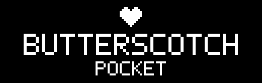

# Butterscotch Pocket: Undertale and Deltarune on openfpgaOS (Analogue Pocket / MiSTer)

<p align="center"></p>

<!--
Introduction: one short paragraph, then the game-data notice.
- What is this, in one sentence? (Whose runner is it a port of, and to what device?)
- Which game and version does it run today?
- What is this repository in relation to Butterscotch, and where does the port live in it?
  (A fork, whose `main` carries the port since 2026-10-10; src/openfpga/ is the port and src/openfpga/dist/ the core definition.
  The openfpgaOS SDK is a separate checkout the build reads.)
- Upstream lists out-of-tree ports under "Community Ports" in its README; the two there open with a
  short note about the port and then carry the original README below. This file follows that shape.
- The notice a reader must not miss: no game data is included; what do they have to supply?
- The sentence that stood in the root README: "This is a port of Butterscotch for the Analogue Pocket, targeted at running Undertale v0.8."
  (The paragraph below says v1.08; which is right?)
-->

Butterscotch built as an openfpgaOS app: this directory is the platform
layer and the core around it, which lists Undertale and Deltarune (one
chapter). It uses Butterscotch's software
renderer (draft PR #429, carried on this branch) drawing RGB555 straight
into the openfpgaOS framebuffer, at 320x240 or 640x480 depending on the room.

This file says what is here and how to use it. It carries no measurements:
frame times, load times and sizes change from build to build, and the
benchmark (see On-device diagnostics) reports them for the build in hand.

You must supply your own `data.win` from Undertale v1.08.

## Layout

| Path | What |
|------|------|
| `main.c` | Entry point: registers `data.win` on data slot 4 and starts the runner |
| `platform/of_platform.c` | Butterscotch platform hooks on the `of_*` API (video, pad, timing) |
| `../` | Butterscotch itself; `../sw/` is the software renderer |
| `dist/` | Pocket core definition (core, data slots, instance JSON) |
| `out/` | Everything the build writes; not tracked |
| `tools/mkart.py` | Draws the menu banner and core icon into `dist/` (run by hand after changing the art; needs Pillow). `docs/banner.png` is its preview of the banner, shown at the top of this file |

The openfpgaOS SDK is a dependency, not part of this repository. Clone
https://github.com/openfpgaOS/openfpgaSDK next to this repository, or pass
`SDK_ROOT=<its path>` to `make`. The build only reads it.

## Build

<!--
- Which host have you built on, and what does it need installed?
- Why are GNU sed and USE_SDK_CONTAINER=0 needed here? (One line each; env.sh has the reasons.)
- What does the reader need to supply, and where does each file go?
- Which commit of the openfpgaOS SDK have you built against? (The port was developed on a408ddc.)
- Where should they look for the rest? (src/openfpga/README.md covers controls, packs, saves,
  the benchmark and diagnostics.)
The commands below match the layout as of 2026-10-08; check they still match how you build.
-->

From nothing, with the SDK cloned next to this repository:

```bash
git clone https://github.com/zenibako/Butterscotch.git butterscotch-pocket
git clone https://github.com/openfpgaOS/openfpgaSDK.git
cd butterscotch-pocket/src/openfpga

# Your own game data: data.win (named game.ios inside the macOS app) and
# the folder holding the game's .ogg files.
cp /path/to/data.win data.win
ln -s /path/to/folder-with-ogg-files music

make            # builds the core and its data packs into out/build/pocket/butterscotch/
make copy       # copies it to a mounted Pocket SD card
```

On macOS, put Homebrew's GNU sed first on `PATH` and set
`USE_SDK_CONTAINER=0` first (the SDK's scripts need GNU sed, and this builds
with the host's `riscv64-elf-gcc` instead of the SDK's Docker image).

```bash
export PATH="$(brew --prefix gnu-sed)/libexec/gnubin:$PATH"
export USE_SDK_CONTAINER=0
```

```bash
make            # RISC-V ELF + Pocket SD tree in out/build/pocket/butterscotch/
make test       # desktop binary ./undertale_pc (run it next to a data.win)
make lint       # strict compiler warnings on this port's own files
make asan       # desktop binary with ASan + UBSan: ./undertale_pc_asan
make copy       # copy the core to a mounted Pocket SD card
```

Put your `data.win` in this directory (on macOS it is `game.ios` inside
`UNDERTALE.app/Contents/Resources/`, renamed), and link the folder with the
game's `.ogg` files as `music/`. The build copies it to
`Assets/butterscotch/common/` in the SD tree.

Desktop extras: `UT_DUMP_FRAME=<n> UT_DUMP_PATH=out.ppm ./undertale_pc`
writes frame `n` of the 320x240 output and exits. `UT_UNCAPPED=1` disables
frame pacing for timing runs. `UT_SEED=<n>` fixes the game's RNG and
`UT_SCRIPT="300:Z,340:D"` presses keys on given frames (U D L R, Z X C,
E = Enter), which together make runs repeatable for pixel comparisons. `make test WADS="14 16"`
enables older bytecode versions for testing other games.

## Deltarune (experimental)

The core lists two games on the Pocket, Undertale and Deltarune. They are
the same code built twice (`GAME=deltarune` enables the newer bytecode
version), and the SD tree is assembled from every game built so far:

```bash
tools/deltarune-setup.sh "<...>/DELTARUNE.app/Contents/Resources" 1   # links your files into games/deltarune/
make && make GAME=deltarune         # both programs; out/build/pocket/butterscotch/ holds both games
make GAME=deltarune deltarune_pc    # desktop binary
```

One chapter at a time. Each game has its own program, data, object files
and save file; on the card they share `Assets/butterscotch/common/`, where
Deltarune's files are `deltarune.win`, `dr_textures.bin` and
`dr_music.bin`. The program still opens `data.win`, `textures.bin` and
`music.bin`: those names are bound to data slots 4 to 6, and the game's
entry (`dist/Assets/butterscotch/zenibako.Butterscotch/Deltarune.json`)
decides which files the Pocket puts in the slots. `tools/mkcard.sh` does
the assembly and leaves out the entry of a game that is not built.

Two things differ from Undertale. The music folder is shared by all
chapters, so the setup script links only the `.ogg` files the chapter's
data file names. And the game reads its text from `lang_en.json`, which
has no data slot to live in, so it is stored in `music.bin` and the file
layer reads it from there (`utAudioReadPackFile`).

`--bench` works for Deltarune too, and `make compare` adds its benchmark
entries to the card (`tools/mkcompare.sh` names them; the route they play is
in `platform/ut_bench.c`).

What the software renderer does for Deltarune's rooms and screens (tile
layers, stacks of mirrored translucent layers, the battle background) is
described where it is done, in the comments of `../sw/sw_renderer.c` and
`../sw/sw_drawing.c`.

## Controls

D-pad = arrows, A = Z (confirm), B = X (cancel), X/Y = C (menu),
Start = Enter, Select = the port's menu (below). L is "Toggle speed/accuracy" and shows the new setting in
the top right corner for two seconds. The core starts in speed (the desktop
build in accuracy, since frames are compared against what the game asks
for). Accuracy is the target: when an optimisation brings accuracy up to
speed's frame rate somewhere, the shortcut speed takes there is removed, so
the two differ only where they still have to. Accuracy draws everything the
game asks for. Speed gives up these for time: 640x480 rooms are drawn at
320x240 and smoothed (see Resolution), blend layers too faint to change a
16-bit colour by more than one step are left out, and frames are skipped
when the game is running behind (see Frame skipping).

### The menu

Select opens the port's menu over the paused game, drawn in the game's own
font (the first of `fnt_main`, `fnt_maintext` and `fnt_small` the game has,
copied out of its texture page the first time; see `platform/ut_font.c`).
Up/Down choose a row and A or Left/Right change it. The debug settings are
on a page of their own: A on "Debug" opens it and B goes back. B on the
first page, or Select or Start on either, closes the menu. The sound stops
while it is open. Everything it sets lasts until
the core is left. It is not in the Pocket's own core menu because the
hardware gives a core no menu variables of its own.

| Row | What it does |
|---|---|
| Resume | closes the menu |
| Performance Mode | Speed or Accuracy, as L sets it |
| Debug | opens the rows below |
| Audio mode | Normal, Disabled, Music only or Sound only, to see what sound costs. Music is what is streamed from the pack (the long tracks) and sound is the effects played from memory. What is muted is not decoded, mixed or read from the card, and still runs its course so that the game is not left waiting for it. Something that was playing unheard is rough until it next starts. `--mute` in `ARGS=` starts with Disabled |
| Show frame times | four numbers in the top left corner over the last 30 frames. The first three are milliseconds (average work, worst work, worst frame period; 33 means full speed); the fourth is how many of the 30 frames were skipped, which is always 0 in accuracy mode. The menu's bottom line gives the same numbers whether or not this is on |
| Show log overlay | the last log lines over the game. The log is kept whether or not this is on, so it can be switched on after a hitch to read it |
| Show script times in log | every two seconds the log gets the twenty game scripts and built-in functions that took the most time, as milliseconds, VM instructions and calls per frame (Butterscotch's GML profiler). The log comes up with it. Measuring slows the game a little while it is on |
| Enable debug buttons | the button chords below (debug mode) |
| Next room, Previous room | goes there as the menu closes |
| Clear interact | sets `global.interact` to 0, for when a cutscene has left the player stuck |
| Save log | writes the log to the spare save slot; leave through the Analogue menu to keep it |

With the debug buttons on (or after starting with `--debug` in the OS
config's `ARGS=`, or `UT_DEBUG=1` on desktop):

- R toggles the log.
- "Accuracy" or "Speed" stays in the top right corner, the way L's toggle
  is set.
- Butterscotch's own debug hotkeys are reached with Select held, since the
  Pocket has no keyboard: Select + Right/Left goes to the next/previous
  room, Select + Start pauses, Select + A steps one frame while paused,
  Select + B clears `global.interact`, Select + X turns script times on or
  off, and Select + Y saves the log. A Select used for one of these does not
  open the menu. The state dumps (F11, F12) are not mapped: they print far
  more than the device can show.
- Select + Down turns sound off or on ("Sound off", "Sound on"): the
  menu's audio mode set to Disabled, or back to Normal from any other.

Anything that would otherwise leave the screen unchanged says what it did
in the top right corner for two seconds, in the game's font: "Next room",
"Previous room", "interact = 0", "Sound off" and "on", "Script times on" and
"off", "Log saved", and "Resumed". A paused game shows "Paused, frame N"
for as long as it is paused, and each step advances N.

## Resolution

Undertale's window is 640x480. Overworld rooms show a 320x240 view scaled
2x, so they are rendered at 320x240. Battles and menus use the full 640x480
with small fonts, so those rooms are rendered at 640x480 and the display
mode is switched to match (`of_video_set_mode`). If the OS refuses the mode
everything stays at 320x240.

L switches to the alternative: every room at 320x240, with the renderer
averaging each 2x2 block of texels when it shrinks a 640x480 screen. Small
text is slightly soft but readable, and those screens cost about a quarter
of the pixels.

## Frame skipping

In accuracy mode a scene that cannot be drawn in a frame's time (33 ms)
runs the whole game slow. In speed mode the time lost to slow frames is
kept as a debt; when it reaches half a frame, one frame is run without
drawing to the screen and the time that saves pays the debt, so the game
keeps its pace and loses smoothness instead. The game's Draw events still
run on a skipped frame, because Undertale keeps logic in them; only the
pixel work is left out, and drawing to surfaces still happens. No two
frames in a row are skipped, and the debt is capped at one frame so a long
stall (a room load) is not chased with a burst of fast frames. The
benchmark never skips.

## Texture pack

`make` runs `tools/mktexpack` on your `data.win` to produce `textures.bin`
(data slot 5): every texture page already converted to the renderer's
16-bit format, cut into 128x128 tiles and run-length encoded tile by tile.
The renderer then reads only the part of a page each sprite, tileset or
font occupies, and keeps one small texture per item; whole pages would not
fit in the Pocket's memory side by side. Without the pack the renderer falls
back to the PNGs inside `data.win`, a whole page at a time. Textures are
kept in a least-recently-used cache that shrinks whenever less than
`TEXTURE_RESERVE_MB` (default 4) of heap would be left for the game.

The pack format changed when tiles were introduced (`UTX2`); a build
ignores an older `textures.bin`, so copy the new one with the core.

## Sound

Decoding Vorbis live is too heavy for the 100 MHz CPU, so `make` runs
`tools/mkmusic` to produce `music.bin` (data slot 6): every sound as mono
IMA ADPCM at `MUSIC_RATE` (32 kHz unless set otherwise). It combines the external `.ogg` files the game
streams (from `music/`, a directory or symlink) with the effects embedded in
`data.win`.

`platform/of_audio_system.c` plays them: long tracks stream through a
read-ahead buffer, short ones are loaded whole on first use and cached. It
applies pitch and gain, mixes the voices in software and writes the OS's
output rate.

A short stretch of output is kept queued. It is topped up once per frame
and also from `platformBusyTick`, which the loaders call between read pieces
and the renderer calls while drawing; without that a frame longer than the
queue leaves a gap in the music. The read-ahead is refilled a piece per
frame, and a track that starts is first read on the following frame, so
room changes do not also pay for music start-up. On the Pocket the pieces
are read with `of_file_read_async` and waited for, which is much quicker
there than `fread`; a read is never left in flight, because the OS fails
ordinary reads while one is. The comments in `platform/of_audio_system.c`
have the sizes and the reasons.

Desktop: `UT_AUDIO_DUMP=out.raw` captures the mixed output (48 kHz stereo
s16le) and `UT_AUDIO_LOG=1` logs every effect, for checking without speakers.

## Saves

Undertale keeps its progress in a few small files (`file0`, `file9`,
`undertale.ini`, ...). `platform/ut_save_fs.c` stores them all as one small
archive in the first save slot (`undertale_0.sav`). The Pocket writes save
slots back to the SD card when the core is closed from its menu. The
benchmark neither reads nor writes saves.

To carry a save over from the desktop game, `make import-save
SAVE_DIR=<folder>` packs a desktop save folder into `undertale_0.sav`
(`SAVE_DIR` defaults to the macOS location, `~/Library/Application
Support/com.tobyfox.undertale`; on Windows it is `%LOCALAPPDATA%\UNDERTALE`,
on Linux `~/.config/UNDERTALE`). Copy that file to
`Saves/butterscotch/common/` on the SD card; it replaces any progress made on
the Pocket. `make export-save EXPORT_DIR=<folder>` goes the other way, and
`tools/mksave list <file>` shows what a slot file holds. The slot file is
deliberately not part of the SD tree, so copying a build never touches saves.

## Button prompts

The game's on-screen key prompts ("[Z or ENTER]", "[C]", the instruction
screen) are renamed to the Pocket's buttons in memory after loading; see
`platform/ut_strings.c`. `data.win` itself is not modified.

## On-device diagnostics

**The log as a file.** A screenshot of the log overlay holds only the last
few lines. The whole log, from start-up on, is also written as text to the
game's second save slot, `undertale_1.sav` or `deltarune_1.sav`: when the
core halts (the end of a benchmark, a fatal error), from the menu's "Save
log", and on Select + Y with the debug buttons on. A core can only write to its save slots, so that is where it
goes; the Pocket copies the slot to `Saves/butterscotch/common/` on the
card when the core is left through the Analogue menu. The text ends at the
first NUL byte (`strings`, or `tr -d '\0'`, reads it).

**The benchmark.** The Benchmark entries (`make compare`) play a fixed
route with scripted input and end by writing a report to the log: time per
frame for each section of the route, then tables of where it went (game
code, drawing by kind of call, sound, presenting) and the draw calls that
cost the most. `platform/ut_bench.c` has the route and says what each
table's columns are. Quote numbers from a report together with the commit
it was built from.

The boot log stays on screen while loading, and every Butterscotch log line
is prefixed with seconds since start, so load stages can be timed by eye.
If the app exits or aborts it halts with the log visible instead of
rebooting.

A frame that takes much longer than it should (`UT_PERF_SLOW_FRAME_MS`)
logs three lines, kept short enough to fit the log overlay:

```
slow 555: step 300 draw 200 out 20 snd 10
  load: rm 0 tx 0 fx 0 mix 12 mus 0
  draw: s5/380 p1/9 t12/40 b1/3 r0/0
```

The first splits the frame's work time (ms) into game code, drawing,
presenting (overlays, copy, flip) and the audio update. The second gives
time spent within those on particular jobs: loading the room, texture pages
and sound effects, mixing audio, and reading streamed music. The third
gives calls/ms for each kind of draw call: sprites, sprite parts (tiles),
text, tiled backgrounds and rectangles. Reading the clock is costly on the
Pocket, so mixing and draw calls are only timed while debug mode or an
overlay is on (and on some frames of a benchmark); otherwise those
milliseconds read 0 and the draw line ends "(not timed)". Press R after
a hitch to read it. Taking a Pocket screenshot freezes the core for a few
seconds, which shows up here as one very slow frame.

Log lines stop going to the OS console after the first frame: the console
is hidden by then and writing to it is slow.

## Status

<!--
- What works on a real Pocket today? What have you actually played through yourself?
- No numbers here: they go out of date within a day of work. Point at the benchmark instead.
- What is still rough? (Which scenes run below full speed? What happens on a room change now?)
- What is untested? (MiSTer; anything past the opening hours.)
-->

- Runs on an Analogue Pocket with the os25 bitstream: boots, plays the
  intro, name entry works, and the first room and menu are playable.
- Use the os25 bitstream. The SDK's runtime `os.bin` paired with os20
  reboot-looped before the OS banner appeared.
- Music, sound effects and saves work on hardware, including a save
  imported from the desktop game.
- Not everything runs at full speed. Which scenes do, and by how much the
  others miss, is what the benchmark is for.
- Deltarune Chapter 1 plays on the desktop build through the opening and a
  Dark World battle. Fog (the hit flash) is not implemented in the software
  renderer.

## Download

<!--
- Is there a build to download yet, and where? Upstream links nightly builds of each platform from
  its CI; the community ports attach a binary to a GitHub release. Neither is set up here yet.
- What can a download contain, given that no game data may be included? (The core, and the two
  tools that build textures.bin and music.bin from the reader's own data.win.)
-->

_To be written._

## Licences and credits

<!--
- Who wrote Butterscotch, and under what licence? What does that licence mean for a core built
  from this repository?
- What does this branch add to Butterscotch? (The software renderer from draft PR #429, this port's
  changes to it, and src/openfpga.)
- What licence is the openfpgaOS SDK under, and does any of it ship in a built core?
- Is there anyone else to credit?
-->

_To be written._

## Disclaimer

<!--
- Butterscotch's own README has a disclaimer about having no association with the software it
  runs and not providing it. Do you want to follow its wording or write your own?
- What must a reader understand about game files before they start?
-->

_To be written._
